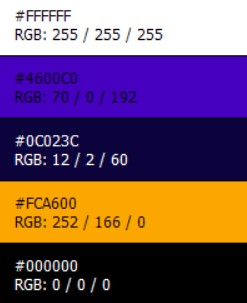
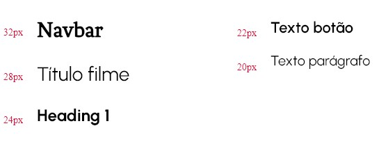

# Programação Web - Trabalho Prático

## Grupo:
- Lucas Santos Rodrigues (20213001521)
- Marcela C. Caram Peito (20213006528)
- Vinícius Ferreira Pinheiro (20213005201)

## Curso:
Engenharia de computação

## Local e Data:
Belo Horizonte, 2023

## 1) Descrição do site:
LMV é uma plataforma online dedicada a entusiastas do cinema, oferecendo uma experiência completa para descobrir, organizar e compartilhar suas seleções de filmes favoritos com amigos. Com uma biblioteca de filmes e recursos interativos, o site é o destino ideal para quem busca uma experiência cinematográfica personalizada e socialmente conectada.

### Recursos Principais:
- Busca de Filmes: Os usuários podem buscar filmes, pesquisando por título, gênero diretor e duração do filme.
- Playlist Personalizada: Os usuários podem criar suas próprias playlists de filmes, organizando-os de acordo com seus interesses, humor ou ocasião. Essas playlists são totalmente personalizáveis, permitindo adicionar, reordenar e excluir filmes conforme desejado.
- Avaliações e Comentários: Os usuários podem avaliar os filmes assistidos e deixar comentários para compartilhar suas opiniões e recomendações com outros usuários da plataforma.
- Rede de Amigos: Os usuários podem adicionar amigos à sua rede dentro da plataforma, permitindo acesso às playlists uns dos outros.
- Interface Amigável e Responsiva: O site oferece uma interface amigável e responsiva, acessível em dispositivos desktop e móveis, garantindo uma experiência consistente e agradável em qualquer plataforma.

## 2) Paleta de cores:
<html>
  
</html>

## 3) Tipografia:
<html>
  
</html>

## 4) Requisitos:
### Boas Práticas de Programação:
- Nomenclatura Descritiva: Escolha nomes significativos para variáveis, funções e classes. Evite abreviações pouco claras. Use padrões de nomenclatura consistentes.
- Funções e Métodos: Mantenha as funções curtas e com uma única responsabilidade. Evite efeitos colaterais e mantenha os efeitos colaterais explícitos. Evite funções muito grandes que dificultem a compreensão do código.
- Comentários e Documentação: Comente apenas quando necessário, preferindo código autoexplicativo. Escreva comentários claros e concisos, explicando o "porquê" do código, não apenas o "como". Mantenha a documentação atualizada, especialmente em APIs públicas.
- Gerenciamento de Erros: Utilize tratamento de erros apropriado e consistente. Registre e reporte erros de forma útil e compreensível para os usuários e desenvolvedores. Faça uso de exceções em situações excepcionais, não para controle de fluxo normal.
- Versionamento de Código: Utilize um sistema de controle de versão como Git. Faça commits frequentes e significativos. Utilize branches para o desenvolvimento de novas funcionalidades e correções de bugs.

### Clean Code:
- Princípio KISS (Keep It Simple, Stupid): Mantenha o código simples e direto, evitando complexidade desnecessária.
- Princípio DRY (Don't Repeat Yourself): Evite duplicação de código, encapsulando lógicas repetitivas em funções ou classes reutilizáveis.
- Princípio SRP (Single Responsibility Principle): Cada classe ou função deve ter apenas uma razão para mudar, ou seja, deve ter apenas uma responsabilidade.
- Princípio SOLID: Adote os princípios SOLID (Single Responsibility, Open/Closed, Liskov Substitution, Interface Segregation, Dependency Inversion) para criar código mais modular e flexível.
- Formatação Consistente: Mantenha uma formatação consistente em todo o código, seguindo convenções de estilo da linguagem.

### Segurança:
- Validação de Entradas: Valide todas as entradas de usuário para evitar ataques de injeção de código, como SQL Injection e XSS (Cross-Site Scripting).
- Autenticação e Autorização: Implemente sistemas robustos de autenticação e autorização para proteger dados sensíveis e funcionalidades privilegiadas.
- Criptografia: Utilize algoritmos de criptografia seguros para proteger informações sensíveis, como senhas e dados financeiros.
- Gerenciamento de Sessões e Tokens: Mantenha as sessões autenticadas seguras e utilize tokens de acesso com tempo de expiração para limitar a janela de ataque.
- Atualizações e Patches: Mantenha o software atualizado, aplicando regularmente patches de segurança e atualizações fornecidas pelos fornecedores e comunidades de software.
